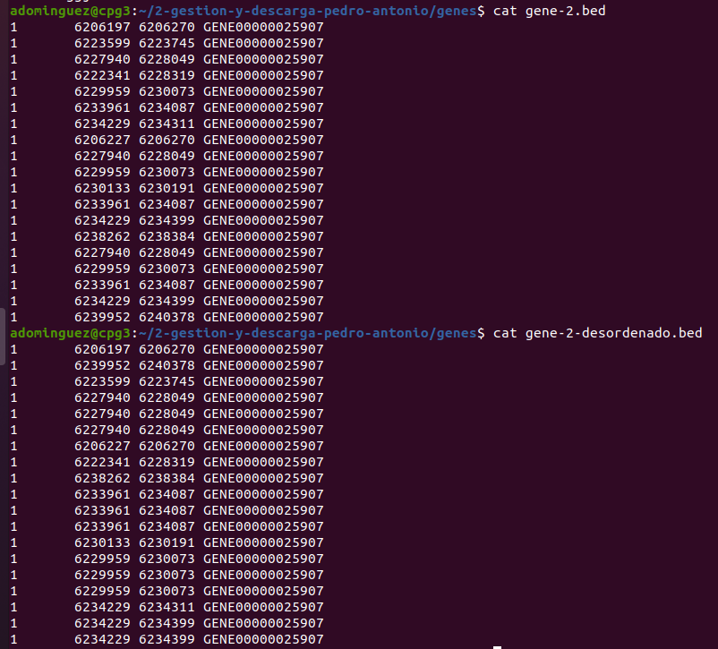

# Sesión III - Redireccionamiento, filtros y pipes

Herramientas computacionales para bioinformática: UNIX, expresiones regulares y shell script

Edita esta plantilla en formato markdown [Guía aquí](https://guides.github.com/features/mastering-markdown/) como se pide en el guión. 
Cuando hayas acabado, haz un commit de tus cambios y súbelos al repositorio antes de la fecha de entrega señalada. 

======================================

## Ejercicio 1
`sort -R` (random) desordena las líneas de un fichero. Prueba a desordenar el fichero `gene-2.bed` y crea un nuevo fichero llamado `gene-2-desordenado.bed`.

Trata ahora de ordenar este fichero de acuerdo a los siguientes criterios: 
1. Sin cortar los elementos
2. En orden descendente
3. Usando a la vez la tercera y la segunda columna (en este orden de prioridad). Consulta el manual para ver la opción -k. 

### Respuesta ejercicio 1
En primer lugar se crea un fichero llamado "gene-2-desordenado.bed" a partir del comando sort -R ejecutado sobre el fichero `gene-2.bed`. Se ha empleado el comando: 
`sort -R gene-2.bed > gene-2-desordenado.bed`
Tras esto empleamos cat para ver el contenido del fichero `gene-2.bed` y del fichero desordenado que se ha creado en nuestra carpeta `gene-2-desordenado.bed`

## Ejercicio 2

Cuáles son y cuántos tipos distintos de "features" hay en `Drosophila_melanogaster.BDGP6.28.102.gtf` y en `Homo_sapiens.GRCh38.102.gtf.gz`? Nota: para trabajar con ficheros .gunzip sin descomprimir puedes usar `zcat`.

### Respuesta ejercicio 2

## Ejercicio 3

Recuerdas `covid-samples.fasta`? Localízalo en tu HOME, y extrae, usando un pipeline, los nombres de las secuencias contenidas en este fichero. Luego saca la primera palabra de cada una, ordénalas y guárdalas en un fichero `covid-seq-names.txt`.

### Respuesta ejercicio 3

## Ejercicio 4

Encuentra, usando una sola línea, el número de usuarias diferentes que tienen al menos una carpeta a su nombre en el '/home' de CPG3.

### Respuesta ejercicio 4

